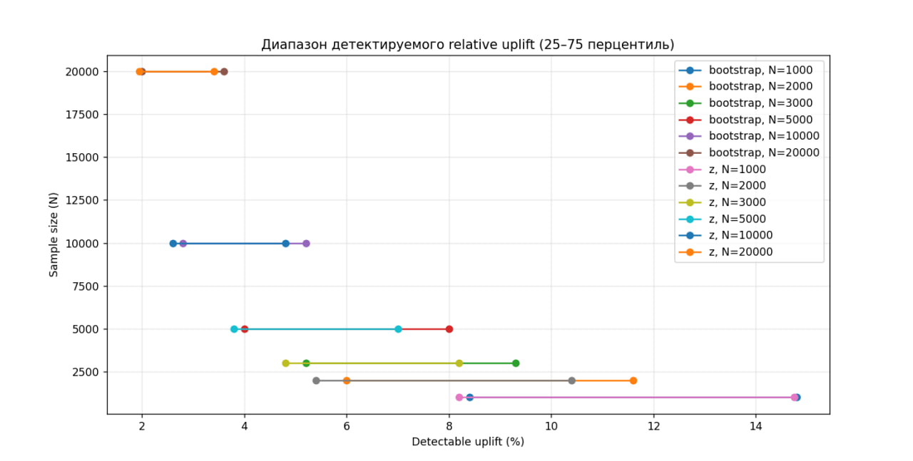

# dz-ufru-sanalyze1
# Анализ минимального детектируемого эффекта (MDE) для измерения lift’а осведомлённости о бренде

В рамках эксперимента моделируется A/B-тест для оценки эффективности рекламной кампании:  
- **Контроль**: респонденты не видели рекламу.  
- **Тест**: респонденты видели рекламу.  
- Метрика: **доля знания бренда «X»** (от 20% до 80% в зависимости от популярности бренда).  
- Эффект измеряется как **относительный uplift**
  
Для каждого размера выборки (`N = 1000–20000`) проведено моделирование мощности теста (target power = 80%, α = 0.05) с учётом вариативности базового уровня осведомлённости.  
Использованы два метода проверки значимости:
- **z-test для разницы долей** (классический)
- **Bootstrap на основе отношения долей** (бизнес-ориентированный)

Результаты показывают **диапазон минимальных relative uplift’ов**, которые можно надёжно обнаружить (25–75 перцентили) и медиану.

## Результаты симуляции

| N       | Метод      | 25% перцентиль | Медиана | 75% перцентиль | Доля успешных симуляций |
|---------|------------|----------------|---------|----------------|--------------------------|
| 1 000   | z-test     | 8.2%           | 10.4%   | 14.8%          | 92.7%                    |
| 2 000   | z-test     | 5.4%           | 7.4%    | 10.4%          | 100%                     |
| 3 000   | z-test     | 4.8%           | 6.4%    | 8.2%           | 100%                     |
| 5 000   | z-test     | 3.8%           | 5.4%    | 7.0%           | 100%                     |
| 10 000  | z-test     | 2.6%           | 3.6%    | 4.8%           | 100%                     |
| 20 000  | z-test     | 2.0%           | 2.4%    | 3.4%           | 100%                     |
| 1 000   | bootstrap  | 8.4%           | 11.2%   | 14.8%          | 91.7%                    |
| 2 000   | bootstrap  | 6.0%           | 8.4%    | 11.6%          | 100%                     |
| 3 000   | bootstrap  | 5.2%           | 6.8%    | 9.3%           | 100%                     |
| 5 000   | bootstrap  | 4.0%           | 5.2%    | 8.0%           | 100%                     |
| 10 000  | bootstrap  | 2.8%           | 3.6%    | 5.2%           | 100%                     |
| 20 000  | bootstrap  | 2.0%           | 2.8%    | 3.6%           | 100%                     |

> Значения — **относительный uplift в %**. Например, при N=5000 можно надёжно обнаружить рост осведомлённости на **5.4% относительно контроля** (например, с 30% до 31.6%).

## Демонстрация на реалистичных данных (N=5000)

- **Контрольная группа**: 28.5%  
- **Тестовая группа**: 34.9%  
- **Относительный эффект**: **+22.6%**  
- **p-value (z-test)**: < 0.0001  
- **p-value (bootstrap)**: < 0.0001  

Эффект **статистически крайне значим** — что ожидаемо при таком сильном uplift’е и большой выборке.

## Интерпретация графика

График показывает, как **размер выборки влияет на чувствительность теста**:
- Чем больше `N` — тем **меньший эффект** можно обнаружить.
- При малых `N` (1000–3000) диапазон (25–75%) **шире** — это отражает зависимость от базового уровня осведомлённости (20% vs 80%).
- При `N ≥ 5000` методы **z-test и bootstrap дают схожие результаты**.
- Для детектирования **эффектов < 5%** требуется **N ≥ 5000**.
- Для **очень слабых эффектов (2–3%)** — **N ≥ 20 000**.

## Практические выводы

1. **Текущий дизайн (N=5000)** позволяет надёжно ловить **эффекты от ~5%**.
2. **Увеличение выборки до 10 000–20 000** оправдано, если ожидается **слабый lift** (например, для известных брендов).
3. **z-test** — быстрый и достаточно точный для `N ≥ 5000`; **bootstrap** — предпочтителен при малых `N` или для строгого соответствия бизнес-метрике.
4. Всегда учитывайте **базовый уровень осведомлённости**: на малоизвестный бренд легче "нагнать" большой relative uplift.
